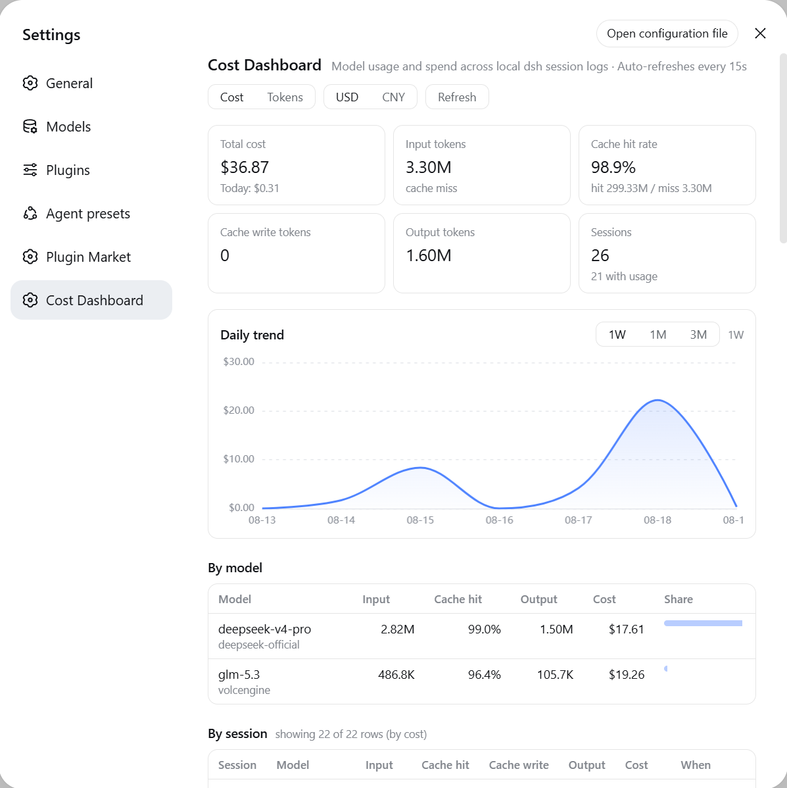
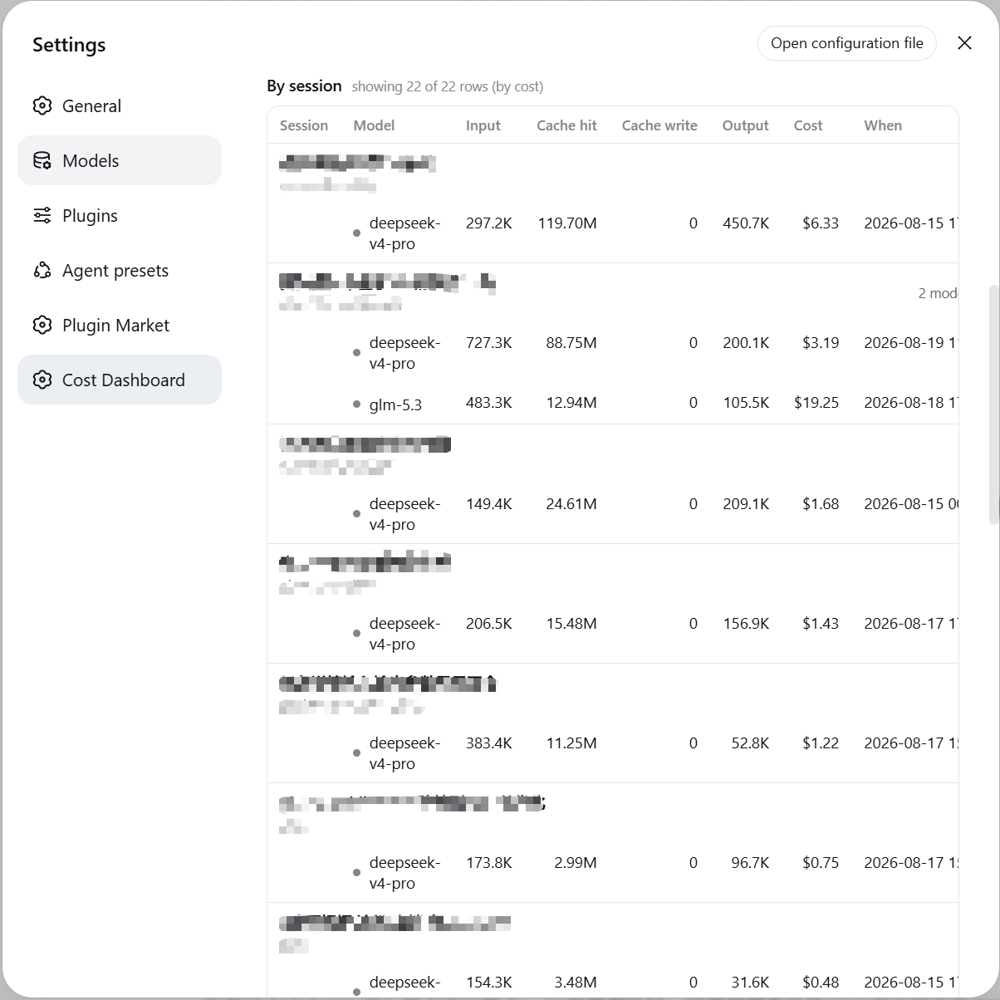

# dsh-cost-dashboard

English | [中文](README.zh.md)

A cost-dashboard plugin for [DeepSeek Harness](https://github.com/deepseek-ai/deepseek-harness) (dsh): aggregates model input / output / cache token usage across **all local sessions**, prices it with a built-in table (including DeepSeek peak/off-peak time-of-day pricing), and renders a dashboard under **Settings -> Cost Dashboard**.

## What you get

- **Two entry points**: Settings -> Cost Dashboard (the settings nav icons are hardcoded by the dsh settings shell, so plugins cannot customize them), plus a **sidebar footer icon button** (data-grid style) that opens the same dashboard in an anchored panel
- **CNY only**: every amount is shown in **CNY (¥)**; entries listed in USD (imported catalogs, foreign models) convert at the configurable `fx.cnyPerUsd` rate (default 6.79)
- **Summary cards**: total cost, today's cost, input (cache-miss) / cache-read rate / output tokens, and the session count of sessions **you** started (subagent logs are folded in, not counted)
- **Daily trend chart**: ECharts smooth line charts (gradient area fill and hover tooltips); cost mode is a single CNY series, tokens mode splits into "input / output" and "cache read" charts on independent scales; selectable **1W / 1M / 3M** ranges (default 1W)
- **By-model table**: tokens, cost, share per model
- **By-session table**: **one row per session-model pair** (a session that used several models appears on several rows, each with its own model, tokens and cost), with title, project directory, subagent badge for a session that spawned delegates. Sortable by **cost or last-active time** - click the Cost / When header, click again to reverse; the cap is applied per session, so a listed session never loses rows
- **Pricing editor**: edit the pricing JSON (including the FX rate) in-page; saves to `~/.dsh/cost-dashboard.json`, effective immediately
- **Auto-synced catalog**: fills in models missing from builtin/overrides from the LiteLLM price JSON (24h TTL + disk cache, degrades on network failure); never overrides builtin or hand-written prices
- **Actual billing (optional)**: with read-only provider keys configured, shows DeepSeek/OpenRouter real balances and OpenAI/Anthropic real spend next to the estimate; domestic cloud vendors (Volcengine/Alibaba/Tencent) are not integrated - prices come from the config file
- **Auto refresh**: polls every 15s while open; the host re-reads only changed log files (mtime + size validated)

<p align="center">
  
  
</p>

## Install

```sh
dsh plugin --profile web add <spec>
```

`<spec>` may be a local path, an npm name, or a GitHub repo:

```sh
dsh plugin --profile web add /path/to/dsh-cost-dashboard
dsh plugin --profile web add github:mike-lee0120/dsh-cost-dashboard
```

`dsh plugin add` runs pnpm in the profile directory and **automatically** appends any `dsh.bundle`-declaring package to `dsh.profile.bundles`. Restart `dsh web` and refresh the page, then open **Settings -> Cost Dashboard**.

Remove with `dsh plugin --profile web remove dsh-cost-dashboard`.

Requires dsh `0.1.0-rc.7`+ and Node >= 22.15 (the `node:zlib` zstd API the host itself relies on for session logs).

## Data source and accounting

- Read-only scan of the current log generation inside `$DSH_HOME/sessions/*/*/` (`session.jsonl.zstd`, `session.vN.jsonl.zstd`, or plaintext `.jsonl`); the numerically highest published generation wins, exactly as the runtime reads it, so a migrated session is never billed from its frozen older generation. Nothing is written, no projection touched.
- Accounting mirrors the official `@deepseek-ai/dsh-token-meter` `tokenUsage` projection:
  - `assistant/chunk {type:'usage'}` is an early sample that survives a later request failure;
  - `assistant/message` usage (or the last `usage` chunk of its `data.stream`) is the final sample for the same `(turn, step)` and **replaces** it instead of double counting, and `llm/retry-started` closes that slot so a retried attempt adds on top;
  - `assistant/attempt` settlements are billed even when no message followed;
  - four disjoint buckets: uncached input (DeepSeek `prompt_tokens` with cache hits subtracted), cache read, cache write, output. Cache write is still folded and still prices `cacheWrite` rates, but no DeepSeek model produces that bucket, so the dashboard and its tables do not display it.
- Model attribution: `assistant/message` carries `message.source.provider/model`; a bare usage chunk (failed request) is attributed to the latest `request/header` model.
- Session attribution: a subagent's log names the session that spawned it in its header (`parentSession`), so its usage is folded into that session - the session table lists real sessions, each marked with how many subagents it absorbed. A log whose parent is missing keeps its own row and is badged as a subagent.
- Mid-session model switches are split correctly.
- Run `node scripts/verify-totals.mjs`: it reconciles against the official `session_projcache.json` (a point-in-time snapshot, so newer logs are skipped and said so), folds every selected log with the token meter's semantics, checks that a migrated session resolves to its highest format generation, and pins DeepSeek's official CNY rates plus the Beijing-time weekday peak window (an actively-writing session may drift by a live-write race, which is expected).

## Pricing

Built-in pricing for 24 entries - 21 models plus three retired DeepSeek names - per 1M tokens, checked 2026-09-24; "hit" = cache-read rate, "write" = cache-write rate, defaults to the cache-miss input rate when unset. DeepSeek rates are the official CNY list prices ([模型 & 价格](https://api-docs.deepseek.com/zh-cn/quick_start/pricing)); every other entry is shown in CNY after conversion:

**CNY-listed models**

| Model | Input (miss) | Input (hit) | Output | Notes |
|---|---|---|---|---|
| deepseek-v4-pro | 4.5 | 0.15 | 13.5 | peak doubles: 9 / 0.30 / 27 |
| deepseek-flash | 1 | 0.02 | 4 | peak doubles: 2 / 0.04 / 8 |
| deepseek-v4-flash | 1 | 0.02 | 4 | retired name, served by DeepSeek-V4.1-Flash |
| deepseek-v4-flash-vision-exp | 1 | 0.02 | 4 | retired name, same Flash rates |
| deepseek-v4.1-flash-expires-on-0910 | 1 | 0.02 | 4 | expired experimental id, same Flash rates |
| kimi-k3 | 20 | 2 | 100 | Moonshot China list price |
| qwen3.8-max | 12 | 1.5 | 36 | Alibaba Bailian China price |
| doubao-seed-2.1-pro | 6 | - | 30 | Volcengine Ark |
| hy3 | 1 | 0.25 | 4 | Tencent Hunyuan |
| minimax-m3 | 3.15 | 0.63 | 12.6 | ≤512K input, half-price list rate |

**USD-listed models** (converted to CNY for display)

| Model | Input (miss) | Input (hit) | Cache write | Output | Notes |
|---|---|---|---|---|---|
| gpt-5.6-sol | 5 | 0.5 | - | 30 | |
| gpt-5.6-terra | 2 | 0.2 | - | 12 | |
| gpt-5.6-luna | 0.20 | 0.02 | - | 1.20 | |
| gpt-5.5 | 5 | 0.5 | - | 30 | |
| gpt-5.4 | 2.5 | 0.25 | - | 15 | |
| gpt-5.1 | 1.25 | 0.125 | - | 10 | |
| claude-opus-5 | 5 | 0.5 | 6.25 | 25 | |
| claude-sonnet-5 | 2 | 0.2 | 2.5 | 10 | temporary rate through 2026-08-31, then $3/$15 |
| claude-fable-5 | 10 | 1 | 12.5 | 50 | |
| gemini-3.6-flash | 1.5 | - | - | 7.5 | |
| gemini-3.5-flash-lite | 0.3 | - | - | 2.5 | |
| grok-4.6 | 2 | - | - | 6 | |
| grok-4.6-fast | 4 | 1 | - | 12 | |
| glm-5.3 | 1.40 | - | - | 4.40 | Z.ai list price; override for the volcengine route |

- DeepSeek V4 peak/off-peak pricing effective 2026-08-17 (off-peak is half of peak; peak hours 09:00-12:00 and 14:00-18:00). Every usage record is timestamped, so the dashboard prices each sample by the host-local clock hour.
- Unpriced models count tokens only.

### Overrides

The in-dashboard **Pricing config** editor saves `~/.dsh/cost-dashboard.json` (per-model whole-entry overrides plus the FX rate):

```json
{
  "fx": { "cnyPerUsd": 6.79 },
  "models": {
    "glm-5.3": { "currency": "USD", "input": 1.4, "inputHit": 0.14, "output": 4.4 },
    "my-local-model": { "currency": "CNY", "input": 2, "output": 6,
                        "peak": { "input": 4, "output": 12 }, "peakHours": [[9, 12], [14, 18]] }
  }
}
```

Fields: `fx.cnyPerUsd` (USD->CNY, default 6.79, used to display USD-listed entries in CNY); per model `currency` (CNY|USD), `input` (cache-miss), `inputHit` (defaults to input), `cacheWrite` (defaults to input), `output`; optional `peak` with its window `peakHours` (Beijing-time hours), `peakWeekdays` (0 = Sunday, weekdays by default) and `peakExcludeDates` (Beijing-time `YYYY-MM-DD`, e.g. statutory holidays). Peak hours use peak rates and unset peak fields fall back to flat; weekends and excluded dates are off-peak all day.

### Auto-synced catalog

- Beyond the builtin table, the dashboard fills missing models from the [LiteLLM price JSON](https://github.com/BerriAI/litellm/blob/main/model_prices_and_context_window.json) (USD rates, converted to CNY for display via `fx`).
- Priority: **user override > builtin > catalog** — the catalog only fills gaps and never overrides builtin peak pricing or your hand-written config.
- Refreshed every 24h and cached at `~/.dsh/storages/cost-dashboard-catalog.json`; on network failure it degrades to the cache, the status is visible in the dashboard footer, and a "Refresh prices" button retries manually.

### Actual billing (optional)

- Expand the **Actual billing** section and configure read-only provider keys to show real balances and spend alongside the estimate.
- Supported: **DeepSeek** `/user/balance` (balance), **OpenRouter** `/api/v1/key` (credits), **OpenAI** Cost API (daily spend), **Anthropic** Cost Report (daily spend).
- Credentials are stored at `~/.dsh/cost-dashboard-credentials.json` (mode 0600):

```json
{
  "providers": {
    "deepseek": { "apiKey": "sk-..." },
    "openrouter": { "apiKey": "sk-or-..." },
    "openai": { "adminKey": "sk-admin-..." },
    "anthropic": { "adminKey": "sk-ant-admin-..." }
  }
}
```

- Use read-only/billing-scoped keys only; remove an entry to stop fetching it. Domestic cloud vendors (Volcengine/Alibaba/Tencent) are not integrated - their prices live in the pricing config.

## Development

Plain `.mjs`, zero build step (host uses only Node builtins; the client is a hand-written module-loader bundle; charts use the vendored ECharts 5 build, Apache-2.0, served locally from `/cost-dashboard/vendor/echarts` - no CDN). Restart `dsh web` and refresh the page after any change.

## Security

- GET routes expose the same surface as other plugins' own routes (local data, no credentials).
- The pricing write (POST) accepts same-origin requests only (Origin==Host).
- Nothing is uploaded; the scan is read-only.

## Known limitations

- Costs are list-price estimates; no plans, discounts, or vouchers; peak hours use the host-local clock.
- Deleting session logs removes their history (statistics are entirely log-derived).
- Very large log corpora slow the cold scan; incremental caching keeps everyday refreshes fast.
